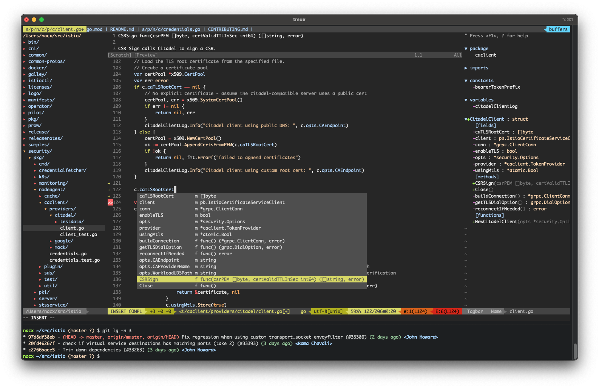

# dotfiles and Vim configuration

These are my dotfiles and Vim configuration to use this awesome editor as a fully-featured IDE for most programming languages.

## Polyglot prompt, Git completion and Kubernetes integration

These dotfiles use [Polyglot](https://github.com/agkozak/polyglot) to customize the shell prompt. It also enables
bash completion for Git and provides a nice integration with Kubernetes.

These featuers can be installed as follows:

```bash
# Clone the repo and get the polyglot fork
git clone https://github.com/nacx/dotfiles.git
cd dotfiles
git submodule update --init

# Source the provided `.bashrc` file (the one in the cloned repo) and consider adding it
# to your existing `.bashrc`.
source .bashrc
```

<a href="https://github.com/nacx/dotfiles/raw/master/img/shell.png"></a>


## Vim features

* File explorer and quick search.
* Language objects information such as classes, methods, variables, etc.
* Code completion.
* Integrated Git status information.
* Easy buffer navigation between open files.
* Integrated terminal.

[](https://github.com/nacx/dotfiles/raw/master/img/vim.png)

### Prerequisites

In order to use the Vim plugins the following pieces have to be installed manually:

* curl
* Git
* Exuberant ctags >= 5.5
* Python3 and its development libraries
* tmux *(only if you are using the integrated terminal)*

If you are using OSX, you will need to install Vim with [Homebrew](https://brew.sh/).
Otherwise auto-completion will not work since the version of Vim that comes by default
is not compiled with Python3 support.

### Installation

There is no automatic way to install this, but only a few links need to be created.
You can install all the plugins and create the links as follows:

```bash
# Install Neovim python3 support
pip3 install neovim

# Clone the repo
git clone https://github.com/nacx/dotfiles.git

# Create the symbolic links in your home
cd ~
ln -s dotfiles/.vimrc
ln -s dotfiles/.vim
```

### Upgrading Python with Homebrew

When upgrading Python with Homebrew, you may encounter issues about some modules not being found by `pythonx`. This
is because Homebrew is still linked to the old Python version. To fix this, check the Python version Vim depends
on, and update the links as follows:

```bash
$ brew info vim | grep python
Required: gettext, lua, perl, python@3.8, ruby

$ brew link --overwrite python@3.8 --force
```

Once the links have been created you're done! All the plugins will be automatically installed the first time you open Vim.

### Integrated terminal

If you want to use the integrated terminal `tmux` needs to be installed. You can use the provided `tmux`
configuration by creating the corresponding symlink:

```bash
# Create the symbolic for the tmux configuration
cd ~
ln -s dotfiles/.tmux.conf
```

In order to easily open Vim in a `tmux` session that allows you to open the console, add the following lines to the *.barhrc* file:

```bash
# Open Vim with tmux
function vim_tmux() {
    VIM_SESSION="vim-${RANDOM}"
    tmux new -s ${VIM_SESSION} -d "VIM_SESSION=${VIM_SESSION} vim $*" \; attach;
}
alias vim='vim_tmux'
```

### Usage cheat sheet

The following keys have been mapped by default:

| Shortcut | Description |
| -------- | ----------- |
| **F2** | Toggle NERDTree |
| **F3** | Toggle Tagbar (it is opened by default in certain source ccode files) |
| **F4** | Open a shell in a tmux split |
| **Shift-Left/Right** | Change to the previous/next buffer |
| **\<Ctrl-Space\>** | In INSERT mode opens the autocompletion popup |
| **sf** | Opens the FZF file search window |
| **sb** | Opens the FZF buffer search window |
| **st** | Opens the FZF tag search window |
| **sc** | Opens the FZF commit search window |

### Go custom commands

The configuration comes with some Go shortcuts and additional customimzations to the Go debugger:

| Commands | Description |
| -------- | ----------- |
| **gdoc** | Shows a popup with the GoDoc for the symbol under the cursor |
| **gs** | Shows the signature of the method under the cursor in the status bar |
| **gdb** | Toggle a breakpoint in the current line |
| **gdr** | Run the program while debugging until the next breakpoint |
| **gdn** | Advance to the enxt line when debugging |
| **gdi** | Step into the current function |
| **gdo** | Step out of the current function |

<a href="https://github.com/nacx/dotfiles/raw/master/img/godebug.png"></a>

